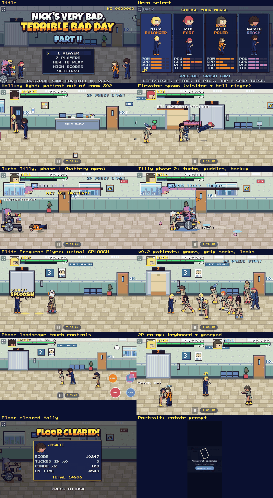
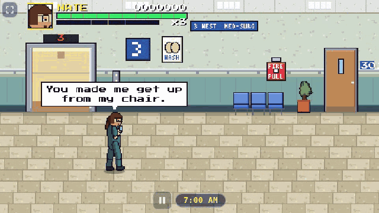
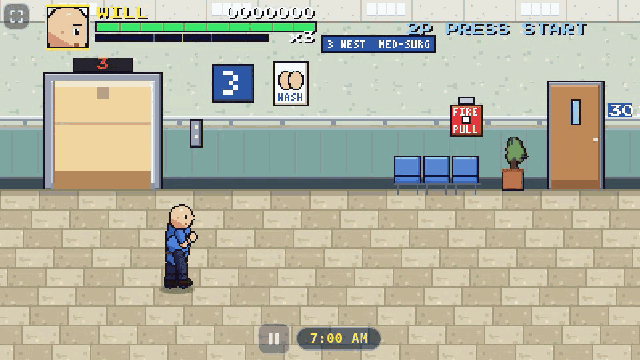
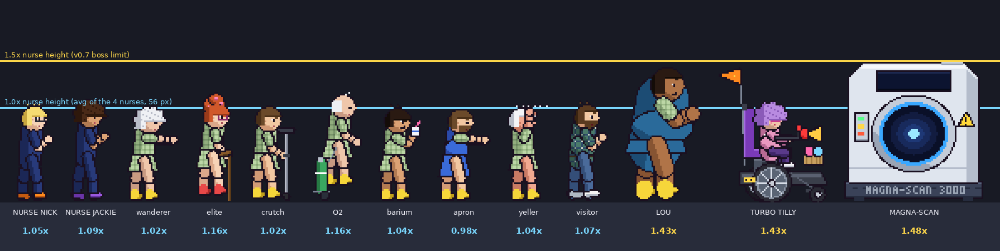
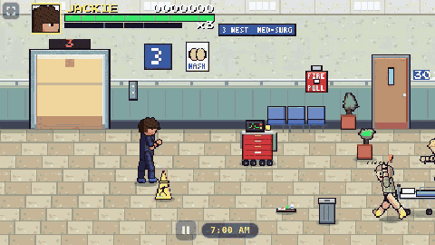

# Nick's Very Bad, Terrible Bad Day Part II

A 1990s-arcade-style beat 'em up about a nurse's worst shift. Pick Nick, Kim, Will, Jackie or (v0.8) the very lazy NASTY NATE, then fight your way
down the Med-Surg hallway past wandering, call-light-spamming and escape-artist patients. Then face **Turbo Tilly**
in her electric wheelchair.

**Play:** https://unclebill-spec.github.io/nicks-bad-day-2/ (works on phones held sideways, with gamepads, and on keyboards; use Install app in Settings)

| | Keyboard (P1 / P2) | Gamepad | Touch |
|---|---|---|---|
| Move | WASD / Arrows | Stick or D-pad | Left thumb (floating joystick) |
| Attack | J / , | X | HIT |
| Jump | K or Space / . | A | JUMP |
| Special (1/3 meter = Ativan jab, full = defib paddles) | L / / | Y | SP (shows ATIVAN / CODE BLUE) |
| Grab a patient / lift a prop | H / M | B | GRAB (shows TOSS / RIDE / PICK UP / THROW) |
| Holding a patient: toss / body slam | toward facing / away (alone or + Attack), or GRAB again | same | push the stick, or GRAB |
| Run | double-tap or Shift | double-tap or RB | double-flick |
| Pause | Enter or Esc | Start | Pause button |

Plain HTML5 Canvas, with no build step: serve the folder (`python3 -m http.server`) and open it. See `AGENTS.md` for the handoff notes
and `CHANGELOG.md` for history.

v0.8: NASTY NATE, the fifth nurse (long reach, slow, Rolling Chair special, lazy speech bubbles):

v0.7: GRAB, toss forward, body slam behind:

Sizes (v0.7): patients match the nurses; bosses are only ~1.4-1.5x a nurse:

v0.6: carry and throw props, a full-size Turbo Tilly, Ativan / defib meter tiers, and the Fire Alarm Yeller:

## Credits and licenses
All characters, art, music and sound in this game are original. Third-party pieces:
- Press Start 2P font by CodeMan38 (SIL Open Font License 1.1) and Luckiest Guy font by Astigmatic (Apache License 2.0). See `fonts/OFL-NOTICE.txt`.
- brileta-sprites (MIT), vendored in `tools/vendor/brileta/` and used only by the art build tool.
- Gravewake sprite and pixel writers (Bill's own tooling), vendored in `tools/vendor/gravewake/`.
